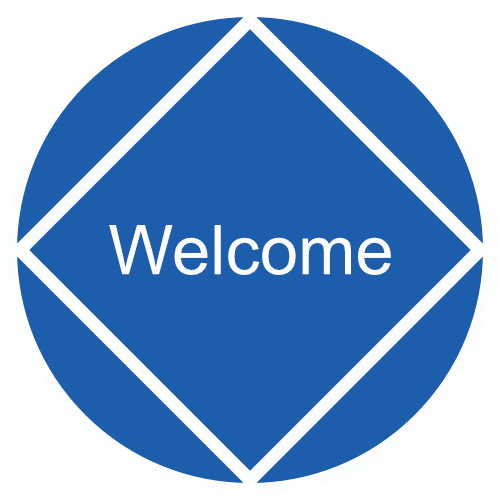

# Discover Recovery

"Discover Recovery" is an app that collects and displays current meetings and activities for recovery groups.

<div style="text-align: center;">

</div>

***
A full stack MERN app featuring CRUD capability.
* Create meetings & activities
* Read currently listed meetings & activities
* Update existing meetings & activities
* Deleted meetings & activities
***

## Getting Started

  * Install dependencies:

Open a terminal and cd into the "client"  directory and install the dependencies(React, React-bootstrap, axios, etc...)

```bash
$ npm install
```

Open a terminal and cd into the "server"  directory and install the dependencies(Express, Mongoose, etc...)

```bash
$ npm install
```
***

* Start your database:

Ensure you have an active local database instance currently running

```bash
$ npm mongod
```
***

 * Seed the database & Start the server:

Open a terminal and cd into the "server"  directory and seed the database then start the server.

```bash
$ npm run seed
```
***...then***
```bash
$ npm start
```
***

* View the website at: http://localhost:3000
***

## How to Use
***
* Click the **Next Meeting** button to see the name, location, and start time of the next available meeting. If there are no upcoming meetings you will be notified. Also if the meeting is within 15 minutes of begining a warning will appear.

* In the Navigation bar at the top, click either of the two dropdowns for **Meetings** or **Activities** to see two options.

    1. *Add Meeting/Add Activity* - Click here to **CREATE** a meeting or activity.

    2. *Meetings/Activities*- Click here to **READ** all of the current listings for the respective selection.

* In order to **UPDATE** a meeting or activity, navigate to either the *meeting* or *activity* page and select the grey **"Edit meeting/activity"** button. Make the desired changes, then select the  grey **"Edit meeting/activity"** button.

* In order to **DELETE** a meeting or activity, navigate to either the *meeting* or *activity* page and select the grey **"Edit meeting/activity"** button ***then*** select the red **"Delete meeting/activity"** button.

* In the Navigation bar at the top, click  the **Join-Us** dropdown to see two options.

    1. *Login*-***Currently tagged for future development.***

    2. *Become a member*- Click here to **CREATE** an account for use in future development.
***

## Contributing
TLM's "movie-buzz" was used as a reference, especially with patterns for controlled inputs making up all of my forms. Thank you to TLM academic support for consistently going above and beyond with their responses and ensuring that their answers to all of my questions were thorough.

## License

  [TLM](LICENSE)